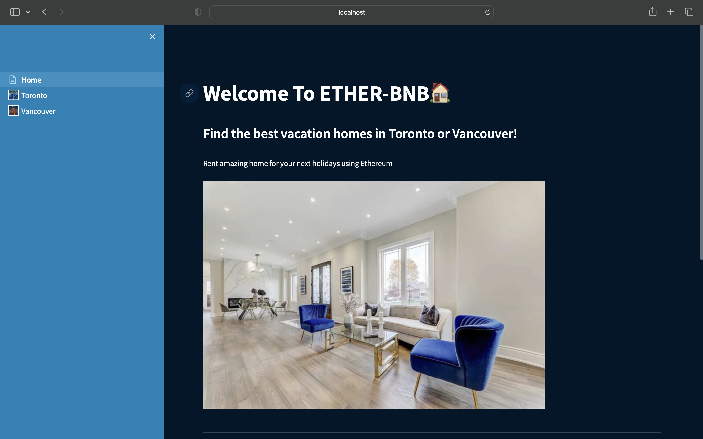
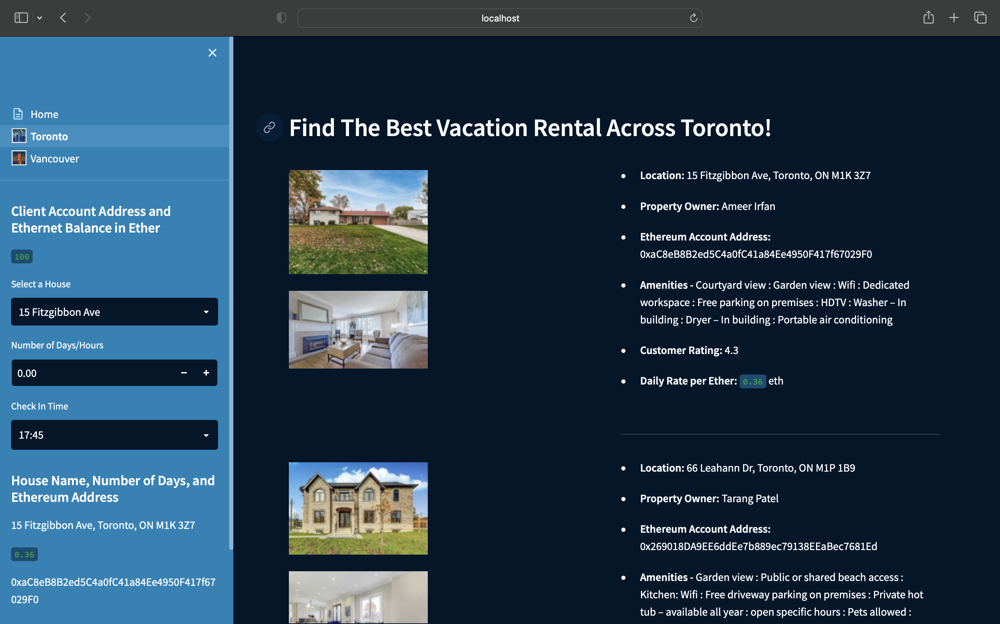
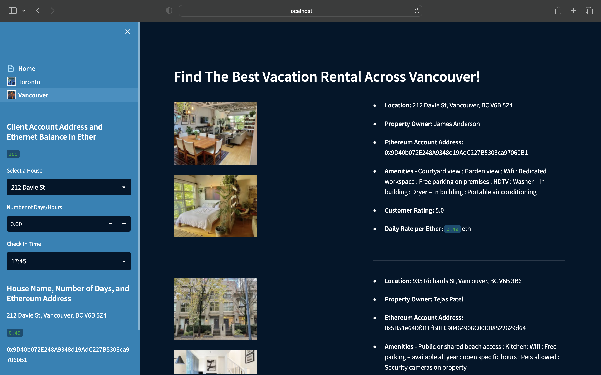

# Vacation Rental

<h2>Getting Started</h2> 

Global dependencies -  
streamlit -  
pip install streamlit

Requests -  
-m pip install requests

Web3 -  
pip install web3

Other -  
•	Ganache  

1. Start by cloning this repo  
2. Open up Ganache and click 'Quick Start'  
3. Paste the mnemonic to the sample.env file.
4. Open terminal at Vacation Rental folder
5. Activate the virtual environment
6. Run the Home.py app using streamlit
    - streamlit run Home.py

   
    
